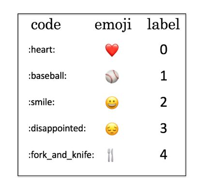

## Project Name

#### Emoji Prediction From Text Messages

## Project Description
* Emoji Prediction from text messages using deep learning. I have used Bidirectional LSTM to train the model using Keras and Tensorflow.
* This model is a small version of emojify.I have only used 5 emoji to train the model and check the accuracy.

### Methods Used
* Deep Learning
* Machine Learning
* RNN
* Bidirectional LSTM

### Technologies 
* Python
* Keras
* Tensorflow

